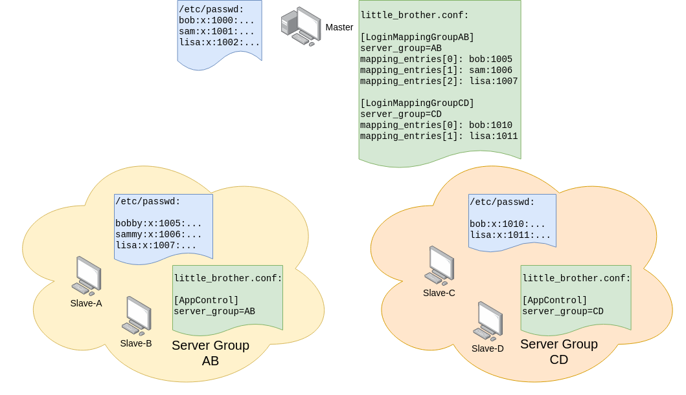
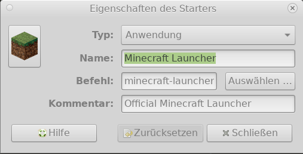
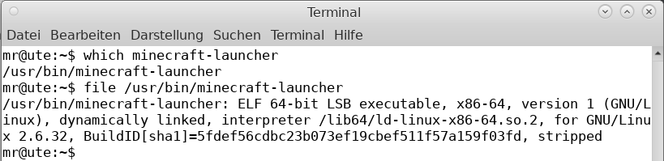
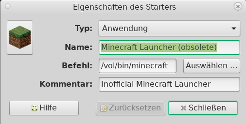
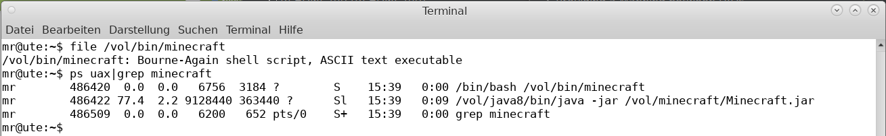

# Advanced Topics

## Detailed Configuration

Some settings of `LittleBrother`, such as the interval between checking the processes on the hosts, 
can only be set in the configuration file. The settings are described in the comments
of the configuration files. See here for templates: 

*   <A HREF="etc/master.config">`master.config`</A>: A configuration file to run the 
    application on a single host.

*   <A HREF="etc/client.config">`client.config`</A>: A configuration file to run the 
    application on a client. This file is relatively simple since it only contains the details to connect 
    to the master host.

The actual active configuration file can be found at `/etc/little-brother/little-brother.conf`.
After changes in the configuration file the application has to be restarted by issuing:

    systemctl restart little-brother

## Configuring the Web Frontend

The default URL of the web frontend is [http://localhost:5555/](http://localhost:5555/). Both the port and/or 
the relative path can be changed. Edit the appropriate settings in the configuration file:

    [StatusServer]
    port=PORT
    base_url=PREFIX

After restarting the server (see above) the web frontend can be reached at 
http://localhost:PORT/PREFIX.

## Users and UIDs

The default behavior of little brother is to retrieve usernames and UIDs from the file `/etc/passwd` using standard
Python libraries. All users in `/etc/passwd` are eligible to be monitored which match these additional criteria:

*   the UID is between 500 and 65000,
*   the username is not `little-brother`,
*   the user has a valid password, and
*   the user's shell is neither `/usr/sbin/nologin` nor `/bin/false`.    

These restrictions should filter out all system and technical users. If you have valid users outside the UID range
above you can use the settings

    [UnixUserHandler]
    min_uid=...
    max_uid=...
    
to override the defaults.

Using `/etc/passwd`, however, may be a problem in two cases:

*   The master host does not have the users defined which will be monitored on the clients.
*   The master host is using an LDAP server to store the users and their credentials.

In both cases you can provide the users and their respective UIDs explicitly in the configuration file:

    [UnixUserHandler]
    user_list=USERNAME1:UID1, USERNAME2:UID2, ...
 
The `USERNAME*` and `UID*` must match those on the client hosts.

## Providing a Mapping between UIDs

When using a master-client set up the assumption is that UIDs on the master host and the client hosts match. In this
case no further configuration will be necessary. If, however, there are differences between master and clients, it is
possible to provide a mapping of the UIDs for the usernames. This mapping is done for each group of hosts sharing
the same mapping by defining a `LoginMapping*` entry in the configuration file of the master host:

    [LoginMappingSomeServerGroup]
    server_group = SomeServerGroup
    mapping_entries[0] = leon:2000
    mapping_entries[1] = christoph:2001
    
The name after `LoginMapping` can be chosen freely. It just has to be unique across all mappings. The actual name
of the server is given by option `server_group`. It is followed by entries for each user in format `username:UID`.
The `username` has to match the username on the master. The `uid` is the UID for that user on the clients of the
server group. Note that the actual username of the user on the clients is irrelevant for the mapping!

In the client configuration the name of the server group has to be configured:

    [AppControl]
    server_group = SomeServerGroup
  
### Example

In the example below there are two server groups with two clients each: `AB` and `CD`. The blue boxes contain the
local usernames and UIDs on all servers. The green boxes contain the required configuration for `LittleBrother`.

Note the following aspects:

*   The UIDs on the master and the clients do not match.
*   The login mappings always contain the usernames on the master. They may differ from the usernames on the clients
   (see `sam` on the client who is called `sammy` on servers in group `AB`).
*   The login mappings always contain the UIDs on the clients.
*   If users do not exist on servers of a group there is no need to supply a mapping entry. See mapping for group
`CD`.   

## Using LDAP For Authorization and Authentication

`LittleBrother` can use an external LDAP server for authorization and authentication. It is activated if all mandatory
options are configured in the master configuration file. See section `[LdapUserHandler]` in 
[master.config](etc/master.config). A fully configured `[LdapUserHandler]` will take precedence over
`[UnixUserHandler]`. If at least one mandatory setting is missing `[UnixUserHandler]` will be used as a fallback. 

All users/accounts in the administration group (setting `ldap_admin_group_name`) 
will be able to login and have access to the restricted pages. The logged-in user will be displayed in the 
menu bar as shown below (`mr` in this case).

If a user group (setting `ldap_user_object_class`)
is provided all users in that group will be offered as potential users to be monitored. If the group is missing
all users in `/etc/passwd` will be offered that fulfill the same requirements as described above for the 
section `[UnixUserHandler]`. Also as above, the requirements can be changed using the same options.

### Installation of the LDAP Package Extension

The functionality required to use the LDAP interface is not included in either `python-base-app` or `little-brother`.
Hence, it is not included in the Debian package either. If you want to use it you will have to load an extra package
AFTER the successful installation of the Debian package. Note that the extension is not relevant for the clients, since
the LDAP configuration solely takes place on the master.

Let's assume that you have successfully installed LittleBrother using the Debian package. In this case you should
have a virtual Python environment at `/var/lib/little-brother/virtualenv/`. We need to use the `pip` located in that
directory as follows:

    /var/lib/little-brother/virtualenv/bin/pip install python-base-app-ldap-extension

Note that this step will require Python to compile the LDAP package so it will take considerably longer than installing
a source-only Python package. This was also the rationale behind excluding the LDAP extension from the 
`python-base-app` since all other dependencies of that package are source-only.

After the package has been successfully installed make sure you have your master configuration setup correctly for LDAP
and restart the LittleBrothe process:

    systemctl restart little-brother

## Migrating From Older Revisions 

### Migrating Revisions < 41

Unfortunately, there is no support for migrating `LittleBrother` for revisions prior to 41. Please, uninstall
the software, remove the database schema, and reinstall.

### Migrating Revisions >= 41

With the introduction of `alembic` in revision 41 it has become possible to migrate the database model automatically.
The startup script of the system service has been modified in such a way that it always calls the option
`--upgrade-databases head`. 

When upgrading to a new version, after the installation of the new Debian package, you will just have to issue

    systemctl daemon-reload
    systemctl restart little-brother

### Migrating to Revision 64 (Version 0.3.x)

Between revisions 63 and 64 there have been substantial changes to the DB data model and the configuration file. 
Since the definition of the rule sets and the implicit definition of the users were moved from the 
configuration file to the database, `LittleBrother` will start an automatic migration of the data in the 
configuration file upon startup. For every subsequent run the user and rule set data in the file will be ignored.
These settings can be removed. If they are still found a warning will be issued.  

## Installation on a Client Host (Client Server/Master Mode)

In addition to the master host any number of client hosts may be configured. The assumption is that the users
to be monitored have login permission to all those hosts and that the usernames on all hosts match. In this
case access times on all hosts are communicated to the master host and accumulated there. The master will
apply the rule sets and determine which users have exceeded their access times. 

The basic installation of `LittleBrother` on a client host is basically the same as on the master host. See the 
main [README](README.md) on how to install the Debian package. Then follow these steps:

*   Copy the client configuration template <A HREF="etc/client.config">`client.config`</A> to 
`/etc/little-brother/little-brother.conf` on each client host.

*   Choose a secret access token and set this token in the configuration on the master host:   

        [MasterConnector]
        access_token=SOME_LONG_AND_SECRET_TOKEN

*   Set the same access token in the configuration on all client hosts. On the latter also the address of the 
master host must be set. Replace `[MASTERHOST]` by the appropriate host DNS name or IP address and
`[PORT]` by the appropriate port.

        [MasterConnector]
        host_url=http://[MASTERHOST]:[PORT]
        access_token=SOME_LONG_AND_SECRET_TOKEN

Note that for the time being the communication between clients and master is always simple HTTP.
 
Restart the application on the client host again by issuing

    systemctl start little-brother
    
Beside the Debian package, there is also a Docker image available which can be used on the client host. 
See [Docker](DOCKER.md) for details.

## Using a Full Fledged Database as Backend

The default backend for `LittleBrother` is a Sqlite file oriented database. It works out of the box. If you prefer
a more mature backend you can switch to a full-fledged database such as MySQL or MariaDB. This is possible, since 
the persistence uses the abstraction layer [SQLAlchemy](https://www.sqlalchemy.org/) which can be used with many 
database systems. Currently, `LittleBrother` should work with MySQL, MariaDB and PostgreSQL.

**IMPORTANT NOTE**: The steps shown below only refer to the MASTER host. The client(s) should ALWAYS use the simple
sqlite backend no matter which kind of backend the master will use! This is due to the fact that the clients never have
to store any data persistently. This is completely handled by the master.

### Configuring the Database

In order to use a database the configuration file in `/etc/little-brother/little-brother.conf` has to be adapted. 
First the SQLite backend has to be deactivated by commenting out the SQLite related setting settings and define
the settings starting with `database_`.

    [Persistence]
    #sqlite_dir = /var/spool/little-brother
    #sqlite_filename = little-brother-feature.sqlite.db
    
    database_driver = SET_ME
    database_host = SET_ME
    database_port = SET_ME
    database_admin = SET_ME
    database_name = little_brother
    database_user = little_brother
    database_password = SET_ME

Replace the `SET_ME` entries by the appropriate values. The driver and port (verify your installation!) 
must be set as follows:

| Database    | Driver Name          | Typical Port Number |
| ----------- | -------------------- | ------------------- |
| MySQL       | `mysql+pymysql`      | 3306                |
| MariaDB     | `mysql+pymysql`      | 3306                |
| PostgreSQL  | `postgresql`         | 5432                |

Note that in revision 64 and above there is no default value for `database_user` anymore. It was `little_brother`.
The name has to be set explicitly now!

### Create the Database

Stop the application by issuing as root user:

    systemctl stop little-brother

Once your configuration is complete you will have to create the database scheme. This is done by calling the application
with a specific option and passing the credentials of the database admin user:

    run_little_brother.py --config /etc/little-brother/little-brother.config --create-databases --upgrade-databases --option Persistence.database_admin=ADMINUSER Persistence.database_admin_password=PASSWORD

The application will start up in non-daemon mode. Press `CTRL-C` to stop the application. If the logging shows a
successful creation of the database, start the application again by issuing as root user: 

    systemctl start little-brother

Note that you can also configure the credentials in the configuration file although this is not recommended since the
admin credentials are ONLY required during the creation of the database should be exposed a little as possible.

## Running Behind a Reverse Proxy

If `LittleBrother` is to be run behind a reverse proxy additional care needs to be taken if the proxy is configured
to accept the application pages at any other URL than the root url ("\"). In this case the recommended
configuration is to use the same prefix for the application itself. 

Consider the following `nginx` configuration:

    ProxyPass /LittleBrother/ http://my.local.hostname:5555/LittleBrother/
    ProxyPassReverse /LittleBrother/ http://my.local.hostname:5555/LittleBrother/

The proxy will map all pages underneath `/LittleBrother` to port `5555` of host `my.local.hostname`. 
The target of the mapping will use the same prefix `/LittleBrother`.

The `[StatusServer]` configuration section of the master host should contain the following setting:

    [StatusServer]
    ...
    base_url=/LittleBrother
    ...

## Monitoring the Application

`LittleBrother` offers two options for operational monitoring. See [here](OPERATIONAL_MONITORING.md) for details.

## Network Tempering Detection

The master-client approach of `LittleBrother` results in all runtime data about processes to be held and evaluated on
the master node. It is there that the decision to terminate a user session will be made. The clients only execute
these decisions. If the network connection between master and clients is cut the clients are basically "headless".
This could be abused by a user (whose activity does not depend on network access) to simply cut the connection to
the master by *pulling the plug*.

As of version 0.3.13 a detected network downtime will result in an automatic termination of user sessions on the
affected clients. The default timeout is 10 times the default scan interval of 5 seconds, that is 50 seconds. This value
(`maximum_time_without_send_events`) can be changed in the configuration file:

    # Number of seconds before warnings are issued about missing connectivity (no successful send events from client to master)
    # Defaults to 3 * DEFAULT_CHECK_INTERVAL.
    warning_time_without_send_events = 15
    
    # Number of seconds before client terminates processes due to missing connectivity (no successful send events from client to master)
    # Defaults to 10 * DEFAULT_CHECK_INTERVAL.
    maximum_time_without_send_events = 50
 
The second setting `warning_time_without_send_events` will be used in the tool 
[LittleBrotherTaskbar](https://github.com/marcus67/little_brother_taskbar) (as of version 0.1.17) to inform the user of 
the impending logout due to connectivity issues.

## Determining Process Patterns for Prohibited Processes
In case you decide to prohibit a process for a specific user you will have to provide a specific process pattern
so that `LittleBrother` is able to detect the process. In most cases this will be simple since most applications are
represented by a single process (binary). However, there are other applications which are called by scripts, usually
in one layer but sometimes in several layers. The latter case it always a good procedure to analyze the calling stack
to optimize the termination behavior.

Let's look at two examples for the same application `minecraft`.

### Application Without Scripting

In order to find out how the application is called we need to view the command which is used in the menu entry
of your desktop environment. The exact way to retrieve this information will depend on the desktop manager used 
in your system. Often the settings of a menu entry can be seen by right-clicking on the menu entry. In case of `mate`
you need to drag the menu entry into the top bar first before you can access the settings:

As you can tell from the entry the command ("Befehl" in German) used to start Minecraft is `minecraft-launcher`.
Open a shell window. At the prompt type `which minecraft-launcher`. Then use the `file` tool and the path of the 
application to determine its type:

As you can see the file is an `ELF` binary and no script. In this case it is safe to use the name of the application 
as a pattern, which would be `minecraft-launcher`

### Application With Scripting

We start out the same way by taking a look at the menu entry:

In this case the command ("Befehl" in German) contains the explicit path so that we can skip the `which` command.
We continue by issuing the `file` command:

As you can see the application is started by shell script. In this case start the application using the menu entry
and type `ps uax|grep APPNAME` at the prompt. Deliberately omit the path of the application. In this example
the process list returns `/vol/java8/bin/java -jar /vol/mirecraft/Minecraft.jar` as the actual application call.
We cannot use `java` as the pattern since this would be too general and prevent ANY java application from being
started. A better choice is the name of the Java JAR, which is `Minecraft.jar` in our case

## Configuring Firewall Support

One of the major drawbacks of `LittleBrother` is its restriction as to which devices can be controlled. Although it
is possible to monitor any device that is *pingable* it may not be possible to deactivate the same device once the 
playtime has been exceeded. As of version 0.4.23, at least it is possible to restrict internet access of the relevant 
devices by installing `iptables` rules during the time that a monitored user is not allowed to use the computer. 
Since most modern games depend on internet access this is tantamount to deactivating the games.  

### Prerequisites

There are some prerequisites before the firewall feature can be used:

* The firewall support will only work in a master-client setup of `LittleBrother` since the master will be used
  to restrict the network access of the clients. If you only have a master node, unfortunately, there's no
  support yet.
* The network traffic of the clients has to routed through the master. This usually requires two changes in the network 
  setup:
  * The clients have to be configured in such a way that their default route points to the master. This can be done
    manually in the setup of the interfaces or can be triggered by using a DHCP server on the master from which the
    clients draw their IP addresses and also their default route.
  * The master has to be configured to forward IP packages. This requires a setting in `sysctl`. 
    See [here](https://linuxconfig.org/how-to-turn-on-off-ip-forwarding-in-linux) for example. 
* The package `iptables` has to be activated. In most cases it should suffice to install the package if not already 
  on the system. 
* The default chain `FORWARD` has to exist. This should also be the default. You can find out by issuing
 
      iptables -L FORWARD

  If this command does not throw an error everything should be OK.
  
* The devices/hosts that need to be blocked have to be configured as devices in `LittleBrother`, the monitoring
  and the blocking of the devices have to be activated. 
  See the [Web Frontend Manual](WEB_FRONTEND_MANUAL.md) for details. 
* There should be not any other programs creating `iptables` entries for the monitored devices since `LittleBrother` 
  will assume that all rules for the IP addresses of the devices (as sources) are handled by itself. This allows the 
  host process to clean out all entries for the clients after a crash. Otherwise, some rules may be left in the system
  which would require the user to issue manual `iptables` commands to fix it. 

### Routing in `iptables`

The diagram below shows the routing which is assumed for the master-client setup for `iptables`. There are two
clients A and B. Both have the IP address of the master node as their default route. The master has its default
route set to the IP address of the DSL modem.

Client A is assigned to user A and the flags "is monitored" and "blockable" are  activated for client A.

Normally, all traffic from the client A is routed through the master and ends up in the DSL modem. When the client has
to be restricted because user A has exceeded his time budget, `LittleBrother` will insert a `FORWARD` saying that all 
packets from the source IP address (`-s`)of the clients to all destinations (`-d 0.0.0.0/0`) have to be dropped.
The client B is not affected by this.

Note that this setup only makes sense if there is a one-to-one relationship between users and clients since there
is no way to restrict network from a specific user on a client. The blocking `iptables` rule always affects ALL users
on the client. If a client is assigned to several users, `LittleBrother` will block it if at least one of the users
has exceeded his time limit!

**Note** 
* All IP addresses in this example except for `0.0.0.0` are arbitrary and may differ from your setup!
* Firewall rules which are added by LittleBrother will show the comment `generated by LittleBrother`. If you run
  into trouble because LittleBrother has not succeeded in removing the rules upon exit you can use the comment to
  manually remove them.

### Configuration

The configuration consists of supplying the IP addresses which are supposed to be blocked for the clients. In the 
normal case this is just the default route to the artificial IP address `0.0.0.0`. The default IPs to be blocked can
be set in the configuration file of the master node:

    [FirewallHandler]
    target_ip[0] = 0.0.0.0

If you want block specific hosts instead, you can supply one or several concrete IP addresses or DNS names, e.g.

    [FirewallHandler]
    target_ip[0] = twerion.net
    target_ip[1] = purpleprison.net
    target_ip[2] = sgpggb.de

would block the top three Minecraft servers in Germany.

**Note**: 

* It is possible to override the default IPs above on a per-device basis. See the section *Configuring Devices*
in the [Web Frontend Manual](WEB_FRONTEND_MANUAL.md).
* In order to activate the firewall extension you will have to configure at least one IP address in the configuration
  file of the master. Just defining IP addresses for a device will **NOT** activate the firewall extension!
