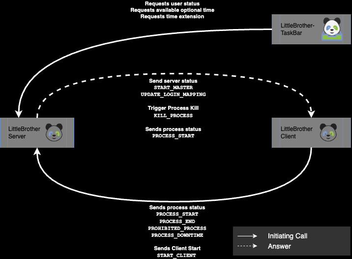

# API Description

## Overview

This page describes how the LittleBrother server interacts with the LittleBrother client and the desktop app 
LittleBrotherDesktop.

## Client Server Communication

All communication between the client and the server is initiated by the client. It regularly sends messages to the 
server using the REST API of the server.

Each message from the client to the server has the attributes `secret`, `hostname`, an array of administration events
(class `AdminEvent`), and one instance of the class `ClientStats`. 

### Standard Message Without Events

The array of admin events can be empty, so the 
simplest message is as follows.

    {
      'secret': 'abcdef',
      'hostname': 'beethoven',
      'events': [],
      'client_stats': {
        'cpu_seconds_total': 0.0,
        'linux_distribution': 'Darwin 23.5.0',
        'python_version': '3.11.9',
        'resident_memory_bytes': 0.0,
        'revision': '200',
        'running_in_docker': False,
        'running_in_snap': False,
        'start_time_seconds': 0.0,
        'version': '0.5.1'
      }
    }

### Standard Message With Events

The following example contains one instance of the `AdminEvent`:

    {
      'secret': 'abcdef',
      'hostname': 'beethoven',
      'events': [
        {
          'delay': 0,
          'downtime': 0,
          'event_time': '2024-07-16 15:11:24',
          'event_type': 'PROCESS_START',
          'hostlabel': None,
          'hostname': 'beethoven',
          'locale': None,
          'payload': None,
          'percent': 100,
          'pid': 88176,
          'process_start_time': '2024-07-16 15:10:08',
          'processhandler': 'ClientProcessHandler',
          'processname': None,
          'text': None,
          'username': 'amelie'
        }
      ],
      'client_stats': {
        'cpu_seconds_total': 0.0,
        'linux_distribution': 'Darwin 23.5.0',
        'python_version': '3.11.9',
        'resident_memory_bytes': 0.0,
        'revision': '200',
        'running_in_docker': False,
        'running_in_snap': False,
        'start_time_seconds': 0.0,
        'version': '0.5.1'
      }
    }

### Administration Event

The administration event is modeled by class [AdminEvent](little_brother/admin_event.py).

| Attribute            | Description                                                                                                                                                                                                                                                                                                                         |
|----------------------|-------------------------------------------------------------------------------------------------------------------------------------------------------------------------------------------------------------------------------------------------------------------------------------------------------------------------------------|
| `hostname`           | Name of the host that this event is coming FROM.                                                                                                                                                                                                                                                                                    |
| `username`           | Name (login) of the user that event is related to, None if the event is not user-related.                                                                                                                                                                                                                                           |
| `pid`                | PID (process id) of the process at operating system level (e.g. as returned by "ps") that the event is related to, None if the event is not user-process-related.                                                                                                                                                                   |
| `processhandler`     | Class name of the instance handling the process events. For the processes which are monitored by "ps" this will always be "ClientProcessHandler", None if the event is not user-process-related.                                                                                                                                    |
| `processname`        | Name of the process that the event is related to in event type PROCESS_START, None if the event is not user-process-related or the type is PROCESS_END.                                                                                                                                                                             |
| `event_type`         | Name of the event type. See top of this file for a list of types.                                                                                                                                                                                                                                                                   |
| `event_time`         | Timestamp of the creation of this event instance in the format "2024-07-17 18:37:44"                                                                                                                                                                                                                                                |
| `process_start_time` | Timestamp of the creation of the user process that the event is related to (as reported by "ps") in format "2024-07-17 18:37:44", None if the event is not user-process-related. Note: This timestamp will be used in combination with p_pid to derive a unique id of the process since the pid by itself may be recycled after a while! |
| `text`               | TODO                                                                                                                                                                                                                                                                                                                                |
| `locale`             | TODO                                                                                                                                                                                                                                                                                                                                |
| `payload`            | Additional structured data used in some of the events types.                                                                                                                                                                                                                                                                        |
| `downtime`           | Downtime in seconds during the runtime of the given process id.                                                                                                                                                                                                                                                                     |
| `percent`            | Only used in connection with the class "ClientDeviceHandler" when the activity of a used is derived from "pinging" hosts: Percentage of the time used as activiry of the user.                                                                                                                                                      |
| `hostlabel`          | Only used in connection with the class "ClientDeviceHandler" when the activity of a used is derived from "pinging" hosts: Label of the host on which the user activity occured.                                                                                                                                                     |
| `delay`              | Delay in seconds before the client should terminate a process in an event of type `KILL_PROCESS`.                                                                                                                                                                                                                                   |

### Client Statistics

The client statistics are modeled by class [ClientStats](little_brother/client_stats.py).

| Attribute               | Description                                                                                        |
|-------------------------|----------------------------------------------------------------------------------------------------|
| `version`               | Version of the LittleBrother application.                                                          |
| `revision`              | Debian package revsion of the LittleBrother package.                                               |
| `python_version`        | Version of the Python interpreter running LittleBrother.                                           |
| `running_in_docker`     | `true´, if the application is running inside a Docker container, `false` otherwise.                |
| `running_in_snap`       | `true´, if the application is running inside a Snap container, `false` otherwise.                  |
| `linux_distribution`    | Version of the distribution of Linux (or other operating System) that LittleBorther is running on. |
| `resident_memory_bytes` | Number of bytes that LittleBrother is currently allocating (as e.g. reported by ``on Linux).       |
| `start_time_seconds`    | Start time of LittleBrother on the client in seconds since EPOCH.                                  |
| `cpu_seconds_total`     | Number of CPU seconds used since the start of the client.                                          |

### Events Types

| Type               | Description                                                                                                                                                                                                                                       |
|--------------------|---------------------------------------------------------------------------------------------------------------------------------------------------------------------------------------------------------------------------------------------------|
| PROCESS_START      | Announce that a new process matching the pattern `Login Process Name Pattern` (in the user configuration dialog) has been found.                                                                                                                  |
| PROHIBITED_PROCESS | Announce that a new process matching the pattern `Prohibited Process Name Pattern` (in the user configuration dialog) has been found.                                                                                                             |
| PROCESS_END        | Announce that a process (which had been announced previously using `PROCESS_START` or `PROHIBITED_PROCESS` has terminated.                                                                                                                        |
| PROCESS_DOWNTIME   | Announce that the client has had some downtime (e.g. it had been put into hibernation mode and as just recovered from it). Note that this event always refers to a concrete process id which has previously been announced using `PROCESS_START`. |
| START_CLIENT       | Announce to the server that a client is (re-)starting.                                                                                                                                                                                            |

## Server to Client Messages

Messages which are returned to the calling client consist of an array of administration events which will (as a rule)
be empty. So, the most common response will be:

    []

The most common answer of the server is to request the killing of one or more processes:

    [
      {
        "delay": 10,
        "downtime": 0,
        "event_time": "2024-07-17 18:40:09",
        "event_type": "KILL_PROCESS",
        "hostlabel": null,
        "hostname": "beethoven",
        "locale": null,
        "payload": null,
        "percent": 100,
        "pid": 41350,
        "process_start_time": "2024-07-17 18:37:43",
        "processhandler": "ClientProcessHandler",
        "processname": null,
        "text": null,
        "username": "amelie"
      }
    ]

For some events the `payload` field will contain some additional structured information, such as an updated 
configuration for the event type `UPDATE_CONFIG`:

    [
      {
        "delay": 0,
        "downtime": 0,
        "event_time": "2024-07-17 18:56:44",
        "event_type": "UPDATE_CONFIG",
        "hostlabel": null,
        "hostname": "beethoven",
        "locale": null,
        "payload": {
          "config:user_config": {
            "leon": {
              "process_name_pattern": "systemd|bash|sh|csh|tsh",
              "prohibited_process_name_pattern": "",
              "active": true
            },
            "christoph": {
              "process_name_pattern": "systemd|bash|sh|csh|tsh",
              "prohibited_process_name_pattern": "",
              "active": true
            },
            "amelie": {
              "process_name_pattern": "systemd|bash|sh|csh|tsh|zsh|sshd*",
              "prohibited_process_name_pattern": "",
              "active": true
            }
          },
          "config:maximum_time_without_send": 50
        },
        "percent": 100,
        "pid": null,
        "process_start_time": null,
        "processhandler": null,
        "processname": null,
        "text": null,
        "username": null
      }
    ]

### Event Types

| Type                 | Description                                                                                        |
|----------------------|----------------------------------------------------------------------------------------------------|
| START_MASTER         | This event is sent to all new clients exactly once after sendig their first message to the server. |
| KILL_PROCESS         | Prompt the client to kill a specific process given by its PID.                                     |
| UPDATE_CONFIG        | Communicate to the client that the configuration has changed.                                      |
| UPDATE_LOGIN_MAPPING | Communicyte to the client that login mapping has changed.                                          |

## Communication Between Server and Desktop App

TODO
