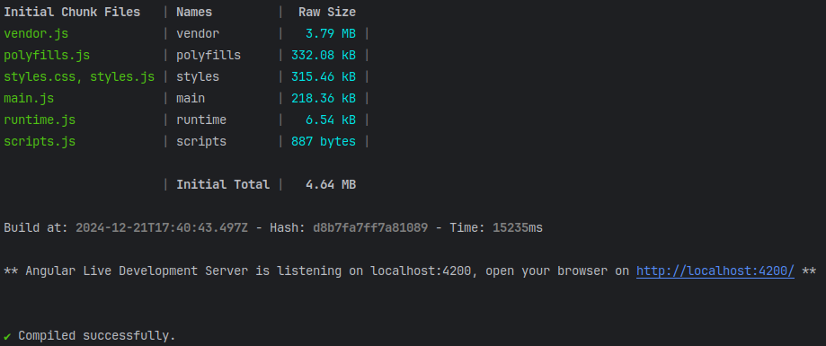

# Contributing

When contributing to this repository, please first discuss the change you wish to make via issue, email, or any other 
method with the owners of this repository before making a change.

Please note we have a [code of conduct](CODE_OF_CONDUCT.md), please follow it in all your interactions with the project.

## Pull Request Process

1. Ensure any install or build dependencies are removed before the end of the layer when doing a build.
2. Update the README.md with details of changes to the interface, this includes new environment variables, 
   exposed ports, useful file locations and container parameters.
3. Increase the version numbers in any examples files and the README.md to the new version that this Pull Request 
   would represent. The versioning scheme we use is SemVer.
4. You may merge the Pull Request in once you have the sign-off of two other developers, or if you do not have 
   permission to do that, you may request the second reviewer to merge it for you.

## Setting Up a Development Environment

### Creating Forks on GitHub

* Create a GitHub account for yourself (your login will be assumed to be `$GITHUB_ACCOUNT`)
* Create forks of the following projects in your GutHub account:
  * https://github.com/marcus67/little_brother 
  * https://github.com/marcus67/python_base_app
  * https://github.com/marcus67/some_flask_helpers

### Cloning the Source Code 

* Install the `git` package as described for your Linux flavor.
* Use your IDE or `git clone --recurse-submodules https://github.com/$GITHUB_ACCOUNT/little_brother.git` 
  to clone the GitHub repository.

The GitHub project [LittleBrother](https://github.com/marcus67/little_brother) has Git submodule references to 
the other two GitHub projects. Make sure that after cloning LittleBrother project the other 
projects have also been cloned. Your IDE will most likely take care of this. 

### Setting up Python

Developing for the backend and the classical frontend of LittleBrother requires a Python development environment.
Follow these steps:

* Install the `python3` and `pip3` packages as described for your Linux flavor.
* Create a virtual Python environment (e.g. with your IDE or the Python pip package `venv`).
* Open a shell and issue:
* `cd $PROJECTROOT`
* `source $PATH_TO_ENV/bin/activate`
* `pip install -f requirements.txt` 

### Starting the Master Server

* Create a copy of the file [master.config](etc/master.config) to e.g. `$MY_LOCAL_DIR/master.config`.
* Open a shell and issue:
* `cd $PROJECTROOT`
* `source $PATH_TO_ENV/bin/activate`
* `export PYTHONPATH=$PROJECTROOT/contrib/python_base_app;$PROJECTROOT/contrib/some_flask_helpers`
* `$PROJECT_ROOT/run_little_brother.py --config $MY_LOCAL_DIR/master.config --no-log-filter`

### Setting Up Angular

Developing for the new Angular frontend of LittleBrother requires a complete Angular development environment. 
Follow these steps:

* Install the `npm` package as described for your Linux flavor.
* Install Angular as described in https://v17.angular.io/guide/setup-local.
* Open a shell and issue:
* `cd $PROJECTROOT/littlebrother-frontend`
* `npm install`
* `ng serve`

If all goes well, you will see some output ending in these lines:

The Angular development server will forward requests to the backend configured 
in the `target` attribute of file [proxy.conf.json](littlebrother-frontend/src/proxy.conf.json). Make sure you
start the LittleBrother on the same port. This is configured in the attribute `[StatusServer].port` of the
LittleBrother configuration file.
