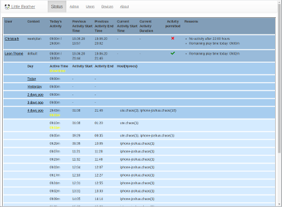
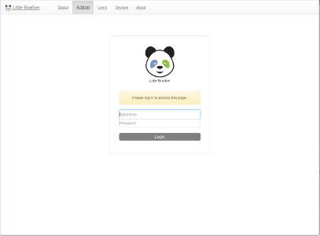
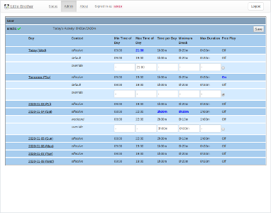
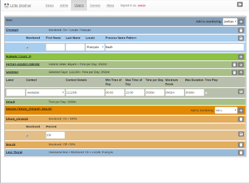
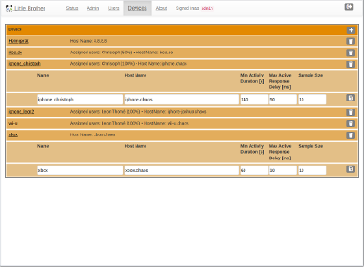
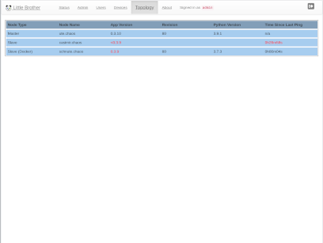
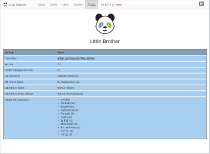
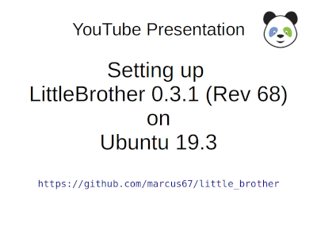
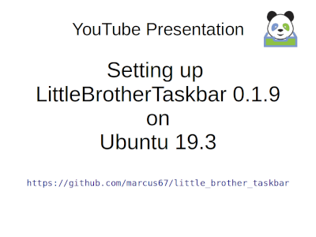

# Parental Control Application `LittleBrother`

## Overview

`LittleBrother` is a simple parental control application monitoring specific processes (read "games") on Linux hosts
to monitor and limit the play time of (young) children. It is designed as a client server application running
on several hosts and combining playing time spent across these hosts but it also works on a standalone host.

When the application determines that a user has exceeded her play time it will terminate the configured 
process. Usually, the user will get several spoken notifications (using the 
[LittleBrotherTaskbar](https://github.com/marcus67/little_brother_taskbar)) before she is actually kicked out so 
that she can log out gracefully in time.

## Contact

Visit the project at [Facebook](https://www.facebook.com/littlebrotherdebian) or write comments 
to little-brother(at)web.de.

## Screenshots

The following screenshots show the web frontend of `LittleBrother`. Click on the thumbnails to enlarge. 

 
 
 
 
 

## Change History 

See [here](CHANGES.md)

## GitHub Status

 
 
 
 

## SourceForge Download Status

## Continuous Integration Status Overview

| Status              | Master                                                                                                                                                                                                                                                                                                                                                               | Mac OS Test                                                                                                                                                                                       | Release                                                                                                                                                                                                                                                                                                                                                              |
|:------------------- |:-------------------------------------------------------------------------------------------------------------------------------------------------------------------------------------------------------------------------------------------------------------------------------------------------------------------------------------------------------------------- |:------------------------------------------------------------------------------------------------------------------------------------------------------------------------------------------------- |:-------------------------------------------------------------------------------------------------------------------------------------------------------------------------------------------------------------------------------------------------------------------------------------------------------------------------------------------------------------------- |
| CircleCI            |                                                                                                                                                                                  |  |                                                                                                                                                                               |
| Test Coverage       |                                                                                                                                                                                                |        |                                                                                                                                                                                      |
| Snyk Vulnerability  |          | not available                                                                                                                                                                                     |  |
| Codacy Code Quality |                                                                                          | not available                                                                                                                                                                                     |                                                                           |

Note: The vulnerability status is derived from the Python PIP packages found in `requirements.txt`.

## Features

`LittleBrother` has the following features:

*   Any number of users can be monitored.

*   Each user can have a specific set of rules defining the permitted playtime.

*   Rules can be adapted to "contexts", such as the day of the week and/or a vacation schedule (currently only 
the German schedules are supported).

*   Play time can be restricted to a time window (from, to).

*   A maximum play time per day can be defined.

*   Users can be forced to take a break after a certain maximum session time.

*   Users can be forced to wait for a minimum break time after their activity.

*   Any number of Linux client hosts can be monitored.

*   There is a master host with a history of the activities of all users. This master host checks the rule sets and
prompts the client hosts to terminate processes if required.

*   The master host offers a simple web interface for viewing the user activity over a configured history length
(e.g. 7 days) and an administration page to dynamically define rule exceptions for a configured number of
days into the future.

*   The web application can be run behind a proxy so that it will be accessible from away allowing remote 
administration after receiving calls from young users begging for more play time.

*   There is a helper application ([LittleBrotherTaskbar](https://github.com/marcus67/little_brother_taskbar)) to 
display the remaining playtime of a monitored user and speak the notifications.

*   The application has international language support. Currently English, Italian and German translations are provided.
Users are invited to provide translations for other languages.

*   Downtime of a server during playtime (e.g. due to hibernation) is automatically substracted from the play time.

*   In addition to the time spent on Linux hosts the application can also monitor activity time on other devices 
such as smart phones or tables. It takes advantage of the fact that most modern operating systems put devices
in some kind of power saving mode while they are not being used. This way, the network response (by `pinging`) can
be used to determine the activity on those devices. In contrast to the Linux hosts, the application
will not be able the terminate the activity. The play time, however, will be added to the overall playtime and
hence will have an impact on the time allowed and also on the break time rules on the Linux hosts.

*   There is a Docker image available (currently for the slave only) which makes it really easy to run a slave on a 
Linux host with a Docker deamon available.

*   The application uses voice generation to inform the user over impending logouts. Also these spoken
messages are internationalized. Optionally, users can be notified using four different popup tools. Note that this
functionality of the `LittleBrother` application has been replaced by the `LittleBrotherTaskbar.` 

## Architecture

The [page](ARCHITECTURE.md) gives a detailed description of the architecture of the application.    

## Tested Distributions

So far, `LittleBrother` has only been released as a Debian package. For other non-Debian based distributions 
there is some basic support using a generic installation script. 
See [this page](NON-DEBIAN-INSTALLATION.md) for details.

| Distribution | Version       | Architecture | Comments                                                               | Most Recent Test |
| ------------ | ------------- | ------------ | ---------------------------------------------------------------------- | ---------------- |
| Ubuntu       | 18.10         | amd64        | See [pip3 issue](https://github.com/marcus67/little_brother/issues/53) | 03.JUN.2019      |
| Debian       | buster        | amd64        | This distribution (buster-slim) is used as base image for Docker       | 01.JAN.2020      |
| Debian       | 10.3 (buster) | amd64        | Feedback from a user as regular install with Mate desktop              | 05.MAR.2020      |
| Mint         | 19            | amd64        |                                                                        | 03.JAN.2020      |
| Debian       | stretch       | armv6l       |                                                                        | 23.MAY.2020      |

## Quick Install (Debian Package)

This guide will take you through the steps required to install, configure, and run the `LittleBrother` application 
on your system. This guide works both for master and slave setups. For setting up a slave there is a second option
using Docker. See the [Docker](DOCKER.md) page for more details.

### YouTube Videos

| Thumbnail and Link to Video                                                                                                                                                  | Duration | Content                                                                                      | Related Versions                          |
| ---------------------------------------------------------------------------------------------------------------------------------------------------------------------------- | -------- | -------------------------------------------------------------------------------------------  | ----------------------------------------- |
|         | 16 min   | Install LittleBrother Debian package, edit configuration file, add user, test functionality  | LittleBrother 0.3.1 on Ubuntu 19.3        |
|  | 14 min   | Install LittleBrotherTaskbar pip3 package, register desktop service, test functionality      | LittleBrotherTaskbar 0.1.9 on Ubuntu 19.3 |

### Download the Software

The application is available as a Debian package 
from the [`release`](https://sourceforge.net/projects/little-brother/files/release/) directory at SourceForge. 
The latest build is available from the [`master`](https://sourceforge.net/projects/little-brother/files/master/) 
directory. Install it as you would install any other Debian package with

    dpkg -i PACKAGE.deb
    apt-get install -f

Note that the second command is required to install missing dependencies since `dpkg` does not run a dependency check.
Instead, it will return with an error which will then be "fixed" by `apt-get`. 

After installation use

    systemctl start little-brother

to start the application right away. The application will 
successfully start up provided that the default port 5555 is available on the host. You can check the success by trying 
to log into the [web frontend](http://localhost:5555/).

### Configuring the Application (Mostly Optional)

The default setup will fit most first-time users (except for the password). The following table contains 
various additional aspects that may require additional configuration.

| Aspect                | Default Setting                                                    | Alternatives                                                    | Reference                                               |
| --------------------- | ------------------------------------------------------------------ | --------------------------------------------------------------- | ------------------------------------------------------- |
| Admin Password        | User `admin` with password `test123`                               |                                                                 | See "Setting Admin Password" below                      | 
| Database backend      | File oriented database [sqlite](https://www.sqlite.org/index.html) | Full fledge database such as MySQL dor MariaDB                  | See [Advanced Configuration](ADVANCED_TOPICS.md)        |
| Web frontend port     | `5555`                                                             | Any other available port                                        | See [Advanced Configuration](ADVANCED_TOPICS.md)        |
| Web frontend base URL | `/`                                                                | Any other path                                                  | See [Advanced Configuration](ADVANCED_TOPICS.md)        |
| User registry         | `/etc/passwd`                                                      | Predfined users and UIDs                                        | See [Advanced Configuration](ADVANCED_TOPICS.md)        |
| Master slave setup    | Use only a master host                                             | Use any number of slave hosts                                   | See [Advanced Configuration](ADVANCED_TOPICS.md)        |
| Mapping UIDs          | UIDs are synchronized across all hosts                             | Each host (group) can have different UIDs                       | See [Advanced Configuration](ADVANCED_TOPICS.md)        |
| Scanning Interval     | Every 5 seconds                                                    | Any other interval                                              | See [Advanced Configuration](ADVANCED_TOPICS.md)        |
| Reverse proxy setup   | No reverse proxy                                                   | Run little-brother behind a reverse proxy (e.g. `nginx`)        | See [Advanced Configuration](ADVANCED_TOPICS.md)        |
| Docker Support        | Slave is installed as Debian package                               | Slave is run as Docker container                                | See [Docker](DOCKER.md).                                |
| Prometheus Support    | Not activated                                                      | Activate Prometheus server port and provide run time statistics | See [Operational Monitoring](OPERATIONAL_MONITORING.md).|

### Setting the Admin Password

For the time being setting the admin password is the only standard configuration that still requires using an editor.
See this [issue](https://github.com/marcus67/little_brother/issues/92).
You have to be `root` to follow these steps (e.g. use `sudo`):
 
*   Use your favorite editor to edit the file `/etc/little-brother/little-brother.conf`.

*   Find the setting `admin_password` in the section `[UnixUserHandler]`.

*   Change the password.

*   Save the file.

*   Restart the application by issuing: 

        systemctl restart little-brother 

From now on the new password will have to be used to access the administration pages.

### Using the Web-Frontend

You are all set now. It's time to set up users to be monitored and optionally devices. See the 
[Web Frontend Manual](WEB_FRONTEND_MANUAL.md). 

### Troubleshooting

So, you went through all of the above but LittleBrother does not seem to work? Maybe this 
[troubleshooting page](TROUBLESHOOTING.md) can help you.

## Caveats

The application `LittleBrother` is far from perfect. Some major caveats are listed here and/or in the 
issue list on GitHub (see [here](../issues)).

*   Every once in a while processes fail to terminate even though they have been killed by `LittleBrother`. 
In these cases the user will still be regarded as logged in although he/she is not. Usually this can only be
solved by trying to kill the processes again using the master user. Database eloquent users may try to 
delete/correct the incorrect process time entries.

*   The web server only responds to HTTP requests. This is probably always OK for communication between the
slaves and the master in local area network. If the master host is to be accessible from the internet it should
be put behind a reverse proxy handling the HTTPS termination (see below). 

## Internationalization

The application uses the PIP package `Flask-Babel` to provide internationalization for the web frontend. Currently, 
the following languages are supported or currently in preparation (in the order they were made available):

| Flag                                                           | Language      | Locale | Status         | Translation provided by    |
| ---------------------------------------------------------------| ------------- | ------ | -------------- | ---------------------------|
|      | English       | en     | Up-to-date     |  Marcus Rickert            |
|                   | German        | de     | Up-to-date     |  Marcus Rickert            |
|                       | Italian       | it     | Up-to-date     |  Albano Battistella        |
|           | Dutch         | nl     | Revision 63    |  Simone & Lex              |
|                   | Finnish       | fi     | Revision 63    |  Isakkii Kosonen           |
|                     | French        | fr     | Revision 63    |  Albano Battistella        |
|                     | Turkish       | tr     | Revision 63    |  Selay Dogan               |
|                     | Russian       | ru     | Revision 63    |  J. Moldawski              |
|                       | Japanese      | ja     | Revision 63    |  Arik M.                   |
|             | Bangla        | bn     | Revision 63    |  Rownak Jyoti Zaman        |
|                 | Thai          | th     | Revision 63    |  Busaba Kramer             |
|                   | Danish        | da     | Revision 63    |  Erik Husmark              |
|                       | Spanish       | es     | Revision 63    |  Ruth Wucherpfennig-Krömer |
|                   | Croatian      | hr     | Revision 63    |  Incognito                 |
|               | Lithuanian    | lt     | In preparation |  N.N.                      |

A revision number in the status column denotes that all texts up to that revision have been localized.
 
Your help with translations is greatly appreciated. Please, contact the author if you are interested in providing
a translation. You do not necessarily have to clone this repository or be familiar with Python to do so.

## Credits

*   Thanks to all the people maintaining the wonderful script language [Python](https://www.python.org/) 
    and the libraries on [PyPi](https://pypi.org/).

*   The country flags were taken from [www.countryflags.com](https://www.countryflags.com/).

*   See the section about on internationalization for credits regarding the translations.

*   The site [www.mehr-schulferien.de](https://www.mehr-schulferien.de) maintains the vacation metadata for
    Germany.
    
*   The icons are provided by [fontawesome.com](https://fontawesome.com). 
