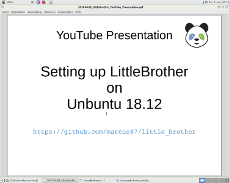

# Parental Control Application `LittleBrother`

## Overview

`LittleBrother` is a simple parental control application monitoring specific processes (read "games") on Linux hosts
to monitor and limit the play time of (young) children. It is designed as a client server application running
on several hosts and combining playing time spent across these hosts but it also works on a standalone host.

When the application determines that a user has exceeded her play time it will terminate the configured 
process. Usually, the user will get several spoken warnings before she is actually kicked out so that she 
can log out gracefully in time.

## Contact

Visit the project at [Facebook](https://www.facebook.com/littlebrotherdebian) or write comments 
to little-brother(at)web.de.

## Screenshots

The following screenshots show the web frontend of `LittleBrother`. Click on the thumbnails to enlarge. 

 
 
 

## Change History 

See [here](CHANGES.md)

## GitHub Status

 
 
 
 

## SourceForge Download Status

## Continuous Integration Status Overview

| Status | Master | Mac OS Test | Release |
|:------ |:------ |:------------------ |:------- |
| CircleCI |  |  |  |
| Test Coverage |  |  |  | 
| Snyk Vulnerability |  | not available | not available |
| Codacy Code Quality |  | not available | not available |

Note: The vulnerability status is derived from the Python PIP packages found in `requirements.txt`.

## Features

`LittleBrother` has the following features:

*   Any number of users can be monitored.

*   Each user can have a specific set of rules defining the permitted playtime.

*   Rules can be adapted to "contexts", such as the day of the week and/or a vacation schedule (currently only 
the German schedules are supported).

*   Play time can be restricted to a time window (from, to).

*   A maximum play time per day can be defined.

*   Users can be forced to take a break after a certain maximum session time.

*   Users can be forced to wait for a minimum break time after their activity.

*   Any number of Linux client hosts can be monitored (currently this requires users to have the same login on all 
machines).

*   There is a master host with a history of the activities of all users. This master host checks the rule sets and
prompts the client hosts to terminate processes if required.

*   The master host offers a simple web interface for viewing the user activity over a configured history length
(e.g. 7 days) and an administration page to dynamically define rule exceptions for a configured number of
days into the future.

*   The web application can be run behind a proxy so that it will be accessible from away allowing remote 
administration after receiving calls from young users begging for more play time.

*   The application has international language support. Currently English and German translations are provided.
Users are invited to provide translations for other languages.

*   The application uses voice generation to inform the user over impending logouts. Also these spoken
messages are internationalized. Optionally, users can be notified using four different popup tools.

*   Downtime of a server during playtime (e.g. due to hibernation) is automatically substracted from the play time.

*   In addition to the time spent on Linux hosts the application can also monitor activity time on other devices 
such as smart phones or tables. It takes advantage of the fact that most modern operating systems put devices
in some kind of power saving mode while they are not being used. This way, the network response (by `pinging`) can
be used to determine the activity on those devices. In contrast to the Linux hosts, the application
will not be able the terminate the activity. The play time, however, will be added to the overall playtime and
hence will have an impact on the time allowed and also on the break time rules on the Linux hosts.

*   There is a Docker image available (currently for the slave only) which makes it really easy to run a slave on a 
Linux host with a Docker deamon available.

*   There is a helper application ([LittleBrotherTaskbar](https://github.com/marcus67/little_brother_taskbar)) to 
display the remaining playtime of a monitored user.

## Architecture

The [page](ARCHITECTURE.md) gives a detailed description of the architecture of the application.    

## Prerequisites

`LittleBrother` requires an installation of a database server such as MariaDB, MySQL or Postgresql. It should work 
with any of those flavors since it uses [SqlAlchemy](https://www.sqlalchemy.org/) as a database abstraction layer. 
However, the current version has only been tested with MySQL.

Also, the application requires a certain affinity with text oriented configuration files since the core rule sets 
about which processes ("games") are being monitored for which user are held in Windows like settings files with 
sections. These rules are regarded as "slow changing" so these settings files (hopefully) need not be changed 
very often and justify this solution at least in one of the early release versions of the application.   

## Tested Distributions

| Distribution | Version       | Comments                                                               | Most Recent Test |
| ------------ | ------------- | ---------------------------------------------------------------------- | ---------------- |
| Ubuntu       | 18.10         | See [pip3 issue](https://github.com/marcus67/little_brother/issues/53) | 03.JUN.2019      |
| Debian       | buster        | This distribution (buster-slim) is used as base image for Docker       | 01.JAN.2020      |
| Debian       | 10.3 (buster) | Feedback from a user as regular install with Mate desktop              | 05.MAR.2020      |
| Mint         | 19            |                                                                        | 03.JAN.2020      |

## Quick Install (Debian Package)

This guide will take you through the steps required to install, configure, and run the `LittleBrother` application 
on your system. This guide works both for master and slave setups. For setting up a slave there is a second option
using Docker. See the [Docker](DOCKER.md) page for more details.

### YouTube Video

There is a YouTube video showing some of the steps below for an Ubuntu 18 target system:

 
### Download the Software

The application is available as a Debian package 
from the [`release`](https://sourceforge.net/projects/little-brother/files/release/) directory at SourceForge. 
The latest build is available from the [`master`](https://sourceforge.net/projects/little-brother/files/master/) 
directory. Install it as you would install any other Debian package with

    dpkg -i PACKAGE.deb
    apt-get install -f

Note that the second command is required to install missing dependencies since `dpkg` does not run a dependency check.
Instead, it will return with an error which will then be "fixed" by `apt-get`. Unless the system has an update-to-date 
`pip3` installation the command `apt-get install -f` has to be run twice since the first time `pip3` will be upgraded
and only the second time `pip3` will be available to install all required PIP packages. 
See [pip3 issue](https://github.com/marcus67/little_brother/issues/53).

After installation the system (`systemctl`) will try to start the application right away. 
This will fail, however, since no valid configuration is available.

### Configure the Software

There are several template files (see directory `/etc/little-brother`) which can be used as a basis for 
your concrete configuration:

*   <A HREF="etc/minimal-master.config">`minimal-master.config`</A>: A minimal configuration file to run the 
    application on a single host with a simple rule set to start with.

*   <A HREF="etc/multi-rule-master.config">`multi-rule-master.config`</A>: A more elaborate configuration file 
    featuring a realistic rule set.

*   <A HREF="etc/minimal-slave.config">`minimal-slave.config`</A>: A minimal configuration file to run the 
    application on a client. This file is relatively simple since it only contains the details to connect 
    to the master host.

Choose the configuration file that best fits your needs and rename it to `little-brother.conf`. Look
at the commented entries and adapt them if required.

You will have to make at least the following adaptation:

*   Change the username in the examples to match the user(s) that you want to monitor.
*   Set a database connection parameters such as the host and optinally the port number. 

### Create the Database

Once your configuration is complete you will have to create the database scheme. This is done by calling the application
with a specific option and passing the credentials of the database admin user:

    run_little_brother.py --config /etc/little-brother/little-brother.config --create-databases --option Persistence.database_admin=ADMINUSER Persistence.database_admin_password=PASSWORD

Note that you can also configure the credentials in the configuration file although this is not recommended since the
admin credentials are ONLY required during the creation of the database should be exposed a little as possible.

### Start the Application

Use `systemctl` to start the application:

    systemctl start little-brother
    
If `systemctl` complains about run-errors, please check the error log in `/var/log/little-brother`. 
In case no errors are returned the web interface should be available at

    http://localhost:[PORT]/
    
where `[PORT]` corresponds to the port number configured with setting  

### Troubleshooting

So, you went through all of the above but LittleBrother does not seem to work? Maybe this 
[troubleshooting page](TROUBLESHOOTING.md) can help you.

## Extended Rule Configuration

For the time being all configuration regarding rules on who and what to monitor must be done in the configuration file. 
A graphical user interface for administrative may be a central extension of one the future releases. 

A minimum rule set for a single user consists of a single rule defining:

*   the login name of the user,
*   the process pattern that is to be monitored,
*   the minimum time of day (optional),
*   the maximum time of day (optional),
*   the maximum time per day (optional),
*   the maximum duration of one session (optional), and
*   the minimum break time between two sessions.

See example below.

    [RuleSetUser1]
    username=user1
    process_name_pattern=.*sh|systemd
    min_time_of_day=16:00
    max_time_of_day=23:00
    max_time_per_day=1h30m
    max_activity_duration=20m
    min_break=10m

The `username` corresponds to the Linux username. It is expected in all small letters. The process name pattern 
is a regular expression to match the processes of the user. The pattern is implicitly prefixed by `^` and 
suffixed by `$` to exactly match the raw process name in the process table. Command line options 
and/or path information is not taken into consideration.

For most purposes in which general login should be prevented or the current login should be terminated 
a simple `.*sh|systemd` should suffice with `.*sh` taking of all console logins and `systemd` 
taking care of all graphical logins.
 
Timestamps must be given in the format `HH:MM` in military time. Time durations must given in the format `HHh:MMm`. 
Either part may be omitted and the minutes may exceed 60.

Each rule can be seen as a day selector. If all days are to be treated equally one rule should do the job. 

If different days are to be treated differently more rules are required besides the default *catch all* rule. 
To this purpose the setting `context` can be used. If its value is `weekday` the setting
`context_details` will contain either:

*   the concrete name of the day of the week,

*   the string `weekend` comprising Saturday and Sunday, or day-coded seven-character string in which `1`, `X`, or `Y` 
denotes an active day and any other character denotes an inactive day. For example: the string "X-X-X--" would denote 
a rule which is active on Mondays, Wednesdays, and Fridays. 

If the value of `context` is `german-vacation-calendar` the rule is active for all vacation days of a specific 
federal state in Germany. In this case the value of `context_details` denotes the name of the federal state:

*   `Baden-Württemberg`,
*   `Bayern`,
*   `Berlin`,
*   `Brandenburg`,
*   `Bremen`,
*   `Hamburg`,
*   `Hessen`,
*   `Mecklenburg-Vorpommern`,
*   `Niedersachsen`,
*   `Nordrhein-Westfalen`,
*   `Rheinland-Pfalz`,
*   `Saarland`,
*   `Sachsen`,
*   `Sachsen-Anhalt`,
*   `Schleswig-Holstein`, or
*   `Thüringen`.

## Monitoring Other Devices

In addition to the processes of the Linux host the application `LittleBrother` can be configured to monitor 
activity on other devices by using the ICMP protocol (`ping`). The assumption is that when a device returns a 
quick response to ping it is currently active (or rather has an active user logged in). If, on the other hand,
the response is slow or if there is no response at all the device is regarded as inactive.

Using a `[ClientDevice*]` section it is possible to configure the scanning of device by giving its DNS name or 
IP address in the field `hostname` as in the example below.

    [ClientDeviceIPhoneUser2]
    name= iphone_user2
    username = user2
    hostname = iphone-user2.my-domain
    sample_size = 10
    min_activity_duration = 60
    max_active_ping_delay = 90

The entry is linked to the `username` on the Linux host. The field `min_activity_duration` denotes how many 
seconds a ping has to be responsive before the host is regarded as active. The field `max_active_ping_delay` 
denotes the maximum response time (measured in milliseconds) a ping may have to still be regarded as 
responsive. The effective delay is computed as moving average over the past `sample_size` response times.

Note that `LittleBrother` is not able terminate any processes on the monitored devices so that the users
may easily exceed their permitted access times there. However, any login times on these devices are added to
the access times on the Linux hosts so that the remaining access time is still influenced. Also, the minimum
break time will apply the point of time when the last other device became inactive.      
  
## Client Server Mode

In addition to the master host any number of slave hosts may be configured. The assumption is that the users
to be monitored have login permission to all those hosts and that the user names on all hosts match. In this
case access times on all hosts are communicated to the master host and accumulated there. The master will
apply the rule sets and determine which users have exceeded their access times. 

A host is configured as slave by providing the `host_url` field in the `[MasterConnector]` section. 
The slaves actively contact the master. The master has no knowledge of the slaves beforehand. See below.
 
    [MasterConnector]
    host_url=http://localhost:5560
    access_token=abcdef

The field `access_token` must match the one configured on the master host. Note that for the time being the 
communication between slaves and master is always simple HTTP.

It is not required that rulesets be configured on the slaves. They will automatically distributed to all
slaves. 

## Monitoring the Application

The application `LittleBrother` has a simple HTTP health check endpoint with relative url `/health` which 
can be monitored by systems such as `icinga`. 
The endpoint will always return HTTP code `200` and the text `OK`. It is automatically active for the master
host since the master host always has its web frontend active anyway. For the slaves the endpoint has to be
activated by setting at least the port the section `[StatusServer]` as in the example below.

    [StatusServer]
    port=5561
  
## Caveats

The application `LittleBrother` is far from perfect. Some major caveats are listed here and/or in the 
issue list on GitHub (see [here](../issues)).

*   The application lacks a graphical user interface for defining rule sets.

*   Every once in a while processes fail to terminate even though they have been killed by `LittleBrother`. 
In these cases the user will still be regarded as logged in although he/she is not. Usually this can only be
solved by trying to kill the processes again using the master user. Database eloquent users may try to 
delete/correct the incorrect process time entries.

*   The web server only responds to HTTP requests. This is probably always OK for communication between the
slaves and the master in local area network. If the master host is to be accessible from the internet it should
be put behind a reverse proxy handling the HTTPS termination (see below). 

## Using Popups

**Note:** The popups described below are obsolete. They have been replaced by the 
[LittleBrotherTaskbar](https://github.com/marcus67/little_brother_taskbar). 

It is possible to activate popups to nofify the user about impending logouts. See the section `[PopupHandler]` 
in the configuration file (e.g. <A HREF="etc/minimal-slave.config">`minimal-slave.config`</A>).
 
The application knows how to handle four different X11 popup tools:

*   `yad`
*   `gxmessage`
*   `zenity`
*   `yad`

The chosen tool must be available on the respective client. If applicable, install the
Debian package having the same name, e.g. to install `yad` enter

    sudo apt-get install yad

Moreover, the user who is supposed to receive the popup messages has to give permission to create X11 clients
using a call to `xhost`:

    xhost +SI:localuser:little-brother

This statement must be added to the appropriate session startup script used on the host. This is a little tricky
since the specific file depends on the windows manager and/or login manager.

These are some good locations:

| Windows Manager | Filename  |
| --------------- | ---------
| Mate            | ~/.materc | 

## Running Behind a Reverse Proxy

If `LittleBrother` is to be run behind a reverse proxy additional care needs to be taken if the proxy is configured
to accept the application pages at any other URL than the root url ("\"). In this case the recommended
configuration is to use the same prefix for the application itself. 

Consider the following `nginx` configuration:

    ProxyPass /LittleBrother/ http://my.local.hostname:5555/LittleBrother/
    ProxyPassReverse /LittleBrother/ http://my.local.hostname:5555/LittleBrother/

The proxy will map all pages underneath `/LittleBrother` to port `5555` of host `my.local.hostname`. 
The target of the mapping will use the same prefix `/LittleBrother`.

The `[StatusServer]` configuration section of the master host should contain the following setting:

    [StatusServer]
    ...
    proxy_prefix=/LittleBrother
    ...

## Internationalization

The application uses the PIP package `Flask-Babel` to provide internationalization for the web frontend, Currently, 
the following languages are supported/prepared:

| Language | Locale | Status    | Translation provided by |
| -------- | ------ | --------- | ------------------------|
| English  | en     | Available |  Marcus Rickert         |
| German   | de     | Available |  Marcus Rickert         |
| Italian  | it     | Available |  Albano Battistella     |
| French   | fr     | Prepared  |  N.N.                   |

Your help with translations is greatly appreciated. Please, contact the author if you are interested in providing
a translation. You do not necessarily have to clone this repository or be familiar with Python to do so.
 