# Web-Frontend Manual

This page describes the web frontend of `LittleBrother` which usually can be reached at 
[http://localhost:5555](http://localhost:5555) on your local machine. It offers access to status information (without
login) and a configuration interface (with login). 

## Listing the Status

The menu entry "Status" lists the monitored users. The top level shows the summary of the play times.

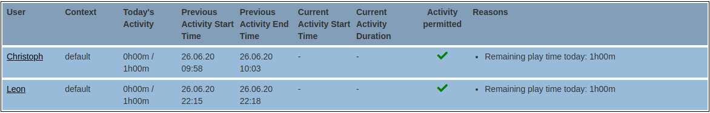

A blinking entry denotes an active login. In case the user is currently allowed to play (see green check mark) the 
column "reasons" shows the estimated remaining play times for the current session (if logged in) and for the day.
If the user is currently blocked (see red cross) the same column shows the reasons why the user is not permitted to 
play and the estimated remaining play time for the day.

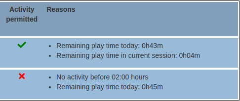

The columns contain the following details:

*   *Context*: Shows the active rule set context for the day.

*   *Today's Activity*: Shows the overall active time and the maximum activity duration for the current day. If one of 
the hosts had a downtime, this column will also show the detected downtime (in yellow) which will be subtracted from 
the play time.
  
*   *Previous Activity Start Time*: the time of day when the most recent (except for the current) activity started.

*   *Previous Activity End Time*: the time of day when the most recent (except for the current) activity ended.

*   *Current Activity Start Time*: the time of day when the current activity started. If the user is not currently
logged in this column will be empty. If there is a current activity, this value will be blinking.

*   *Current Activity Duration*: the time duration of the current activity. If the user is not currently 
logged in this column will be empty. If there is a current activity, this value will be blinking.
   
     
The second level can be opened by clicking on the name of a user. It will show the daily play time, the number 
of logins and the hosts of the last seven days of the selected user.

The columns contain the following details:

*   *Active Time*: The overall play time on that day.
*   *Activity Start*: The earliest login of the user on that day. 
*   *Activity Start*: The latest logout of the user on that day.
*   *Host(#procs)*: A list of hosts that the user logged into on that day including the number of logins on each host. 

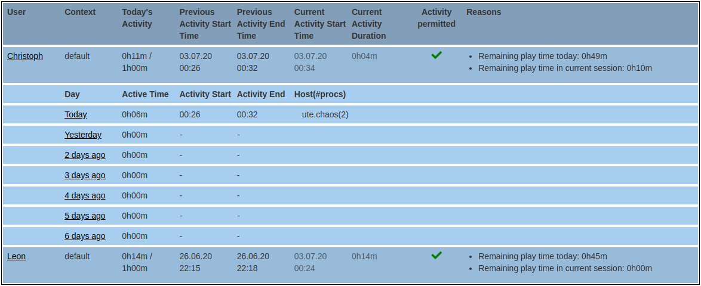

The third level can be opened by clicking on a day summary of a user. It will show the individual play times and
hosts of the selected user on the selected day. The entries are sorted by the start time in descending order with
the most recent entry at the top.   

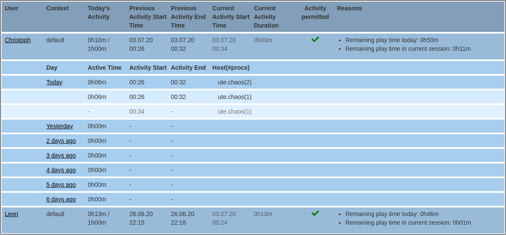

## About Page

The page shows some status information of the installed version of `LittleBrother` and a list of supported languages.
When reporting issues on GitHub it is usually very helpful for the developers if you include the *Git Commit ID*
into your issue text.
 
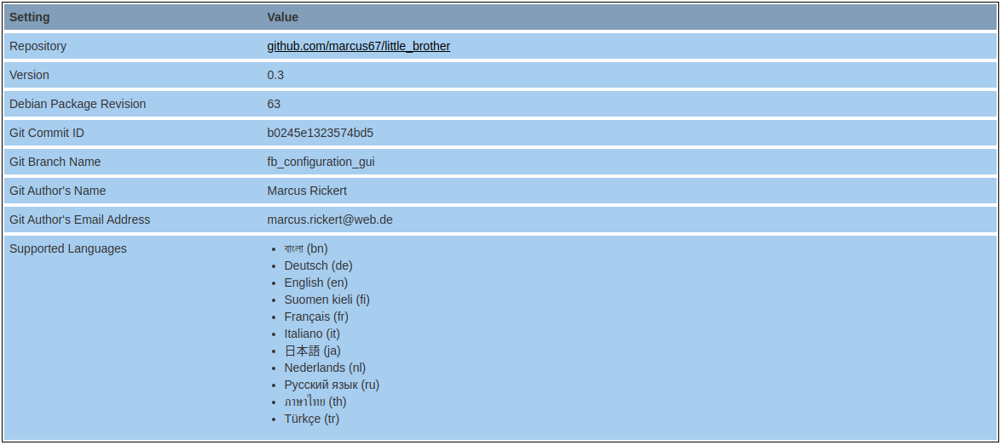  

## Logging In

The status page and the about page are accessible without login. All other pages require the login credentials of
an administration user. Currently, the name of the administration user defaults to `admin`. The password needs to
be set in the configuration file (see the main [README](README.md)).

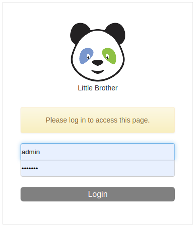  

After successful login the user will be display in the menu bar.

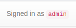

## Checking the Topology of the LittleBrother Network  

Although `LittleBrother` can run on a single PC (master), it is possible to monitor several client PCs at the same time.
In order to keep the overview over the network of PCs the tab `Topology` provides a list of the currently known PCs.

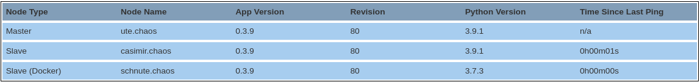

It shows the master and all client nodes with the following columns:

* *Node Type*: Denotes the type of node ("Master" or "Client"). There is exactly one master and `0..N` clients. If
    the node process is running in a Docker container it will have an additional `(Docker)` remark.
    
* *Node Name*: Denotes the unique name of the node. It usually corresponds to the host DNS name, but it can be set in 
  the configuration file.
    
* *App Version*: Denotes the version of the `LittleBrother` process on that node.

* *Revision*: Denotes the revision of the `LittleBrother` process on that node.
 
* *Distribution*: Denotes the Linux distribution running on that node as reported 
  by package [`distro`](https://pypi.org/project/distro/).

* *Python Version*: Denotes the version of the Python interpreter running the `LittleBrother` process on that node.

* *Time Since Last Ping*: Denotes the time since the master has received the most recent statistics from that node.
    Since the default ping time is five seconds this value will usually not exceed four seconds.
    
### Detection of Suspicious Constellations

There is some support for detecting suspicious configuration constellations by highlighting value in the table above
in red.

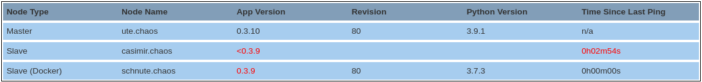

#### Outdated Clients and Version Checks

If a client is detected whose version is older than 0.3.9 the additional metadata (AppVersion, Revision and Python
Version) is not available. In this case the AppVersion will show "< 0.3.9" in red color. If the client version is 
smaller than the master version, the AppVersion will also show in red. See screenshot above.

As of version 0.4.9 of `LittleBrother` the master node will check SourceForge for versions automatically. If a 
new version is found, this version will be reported in a banner underneath the navigation bar. The banner also
includes a download link.

The version check refers to a configured update channel with `master` being the default channel. The version is
checked once a day.

#### Inactive Clients

If the master has not received a message from the client for more than a certain number of seconds (defaults to `60`)
the value in column *Time Since Last Ping* will be displayed in red. See screenshot above.

**Note:** The master cannot differentiate between clients that are only temporarily not available and clients which have
completely been removed from the topology. In the latter case the master has to be restarted to "forget" the 
removed clients.

## Administration

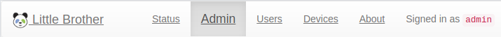

The administration page enables the administrator to override the default restrictions for the monitored users. 
This is possible for the current day and up to 7 days into the future.

The top level shows the names and today's activity of the current monitored users.
In case the user is currently allowed to play (see green check mark) the 
row shows the estimated remaining play times for the current session (if logged in) and for the day.
If the user is currently blocked (see red cross) the row shows the reasons why the user is not permitted to 
play and the estimated remaining play time for the day.

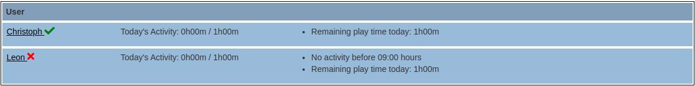
   
The second level can be opened by clicking on the name of a user. It will show the active restrictions of
the current day and the next seven days of the selected user. The column "Context" denotes which rule set is active
on the respective day. The entries are sorted by the start time in ascending order with
the current day at the top.

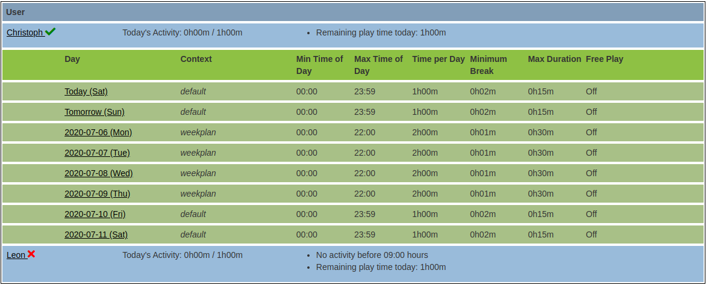

The third level can be opened by clicking on a day row. It will show input fields to override the default
restrictions of the active rule set of the selected day.    

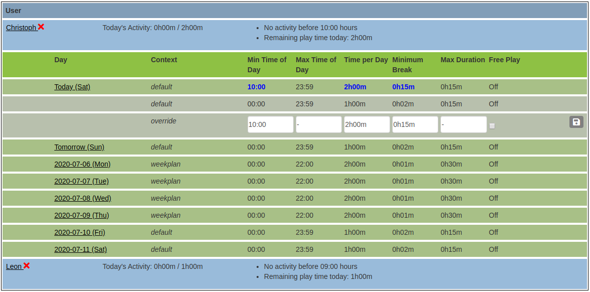

To override settings enter the desired values and click the save button.

Most of the input fields require a certain input format. If the values violate the format, 
a validation message will be displayed. All errors have to be taken care of before the settings will be saved.

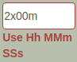

When default values are overridden the day row shows the values in blue color. Removing the overriding values 
removes the color again. 

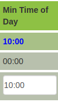

### Managing Time Extensions (handled by the administrator)

Often, it is helpful to be able to extend the time of an active user sessions by some minutes or to grant time
to a user who is currently not allowed to user the computer. In principle, this is possible by changing one or several
of the settings above, but it is not easy and not quick. In come the *time extensions* which allow you to do just this.

Normally, that is without an active time extension, the administration below the user summary looks as follows.

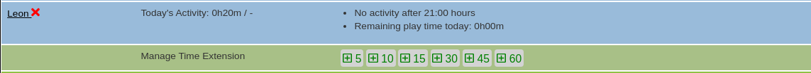

The dialog shows a number of green buttons with plus signs and numbers on them denoting minutes. Pressing one of these 
buttons activates the time extension with the selected number of minutes.

The dialog changes to the following display.

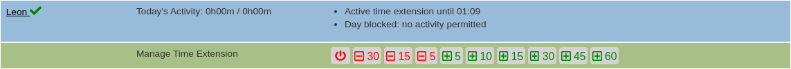

The rule summary on the top right states that the time extension is active and shows the current end time. In the
row below there are some red buttons now with minus signs and numbers on them also denoting minutes. Pressing one of 
these red buttons shortens the time extension by the selected number of minutes. Pressing a green button will further
extend the time by the selected number of minutes. Shortening the extension by more than its current length or 
pressing the red off button will remove the time extension.

The exact point of time when the extension starts depends on the current state of the user:

*   *The user is active*: The time extension is *appended* to the current session effectively extending it by the
number of selected minutes.
*   *The user is not permitted to use the computer*: In this case the time extension is created starting right away
and having the length of the selected number of minutes.

**Please, note the following aspects**:

*   Time extensions grant instant computer time overriding other restrictive rules. This will always allow the user
to play at least until the end of the time extension. It will, however, **not** change the daily limit, nor will it
influence the way minimum break times are computed.

*   In the rule summary, active restrictive rules will still be displayed, but they will be inactive. The only rule
that will always show the "right" time is the one regarding the remaining number of minutes in the current session.

*   In contrast to the normal rule sets which usually have trouble to cover computer times spanning midnight
elegantly, time extensions will handle this case nicely.       

### Managing Time Extensions (handled by the user)

In addition to the time extensions handled by the administrator, it is also possible to grant a certain time a day
which can be used by the user to request time extensions on the fly. This optional time is administered with the
corresponding rule set. See the configuration of rule sets further below.

The idea is that time extensions may be required very urgently at the end of session to "kill that final invader" or
maybe save a game context. For the user, it would be contact the administrator to ask for a time extension 
and in some cases it may simply be impossible. With the help of the "optional time" the user can avoid the critical
moments. However, using the optional time will NOT increase the overall playtime of the day which is intentional.

The actual request is executed by the user through the tool 
[LittleBrotherTaskbar](https://github.com/marcus67/little_brother_taskbar).

## Configuring Users

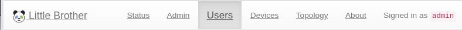

Before a user can be monitored she has to be added to the users list of `LittleBrother`. After installation the
users list is empty. The application will try to retrieve the users on the master host by querying the 
`/etc/passwd` file using standard Python libraries. See [Users and UIDs in README](README.md) for details. 

All users found that are not being monitored yet will be offered in the dropdown menu following "Add to monitoring":

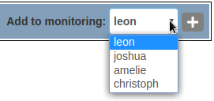

To add the user choose the username from the dropdown list and click the add button:

After the user has been added her top level entry will be shown:

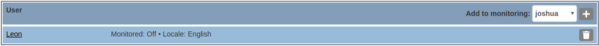

Click on the username to change to second level of the user entry:

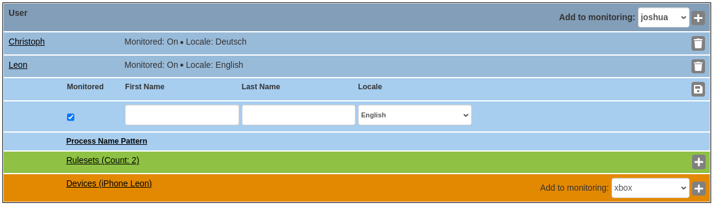

The details will show the following items:

*   *Monitored*: denotes if the user will actually be monitored. This will be un-ticked for all new users and should 
only be ticked off after the user has been configured completely using rule sets and optionally devices.

*   *First Name*: sets the first name of the user. When set the first name will be used in notifications instead of the
username which may be unpronounceable. 

*   *Last Name*: sets the last name of the user. This is only used as label in lists.

*   *Locale*: sets the language in which notifications are spoken to the user. The locale will be passed on to the
tool [LittleBrotherTaskbar](https://github.com/marcus67/little_brother_taskbar) to this purpose. For a new user
the locale always defaults to the locale which is detected from the browser.

*   *Process Name Patterns*: use this link to open the next level of configuration for setting 
    regular expressions defining specific processes. See below.

### Specifying Login and Prohibited Processes

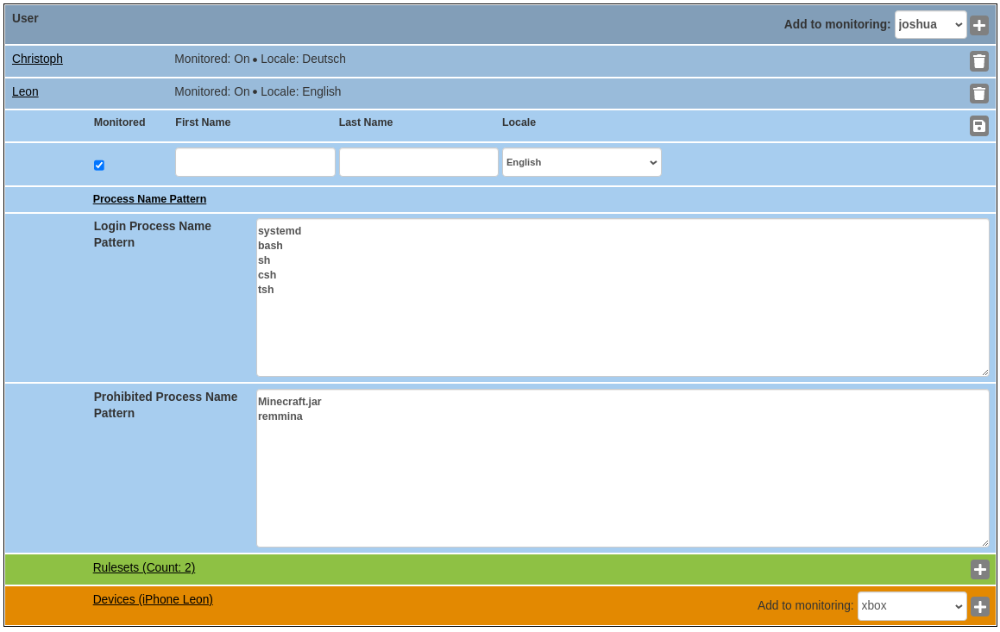

After opening the link "Process Name Pattern" the next level of configuration opens displaying two text areas
for specifying process patterns.

*   *Login Process Name Pattern*: sets a regular expression defining the processes which represents a "login" by the 
    user. The default value comprises all standard shells and `systemd` which is started by login process using X11. 
    Only  change this setting if you absolutely know what you are doing.

    As of version 0.3.12 the pattern will be matched against the complete command line and no longer the process name 
    only. This requires/permits the pattern to be more precise if you have several binaries with the same name in 
    different directories. Thanks to [bhulsken](https://github.com/bhulsken) for providing a pull request.
    
    As of version 0.4.4 the pattern can span several lines. The sub patterns on the lines will implicitly be combined
    into a single pattern using the `|` operator of regular expressions. 
    
    **Note**: In order to guarantee backward compatibility prior to version 0.3.12, process name patterns without a 
    single `/` will be braced by `.*( PATTERN ).*` so that the original expression will be matched at any location in 
    the command line. If no `/` is contained in the configured expression it will be used literally.
    
*   *Prohibited Process Name Pattern*: sets a regular expression describing all the processes that the user is not
    allowed to start. Per default, the pattern always scans the complete command line of the process. The sub patterns
    on each line will be braced by `.*( PATTERN ).*` and combined into a single pattern using the `|` operator 
    of regular expressions. As soon as a matching process is detected the user be played a notification that the 
    process will be terminated immediately.
    
### Adding Rule Sets

When a new user is created, there is always one default rule created for her which will act as a fallback if no other
rule applies. However, the new rule does not contain any restrictions yet:

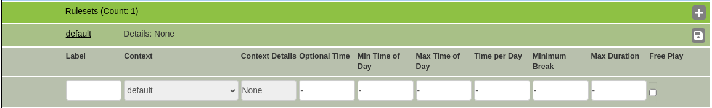

Use the entry fields to optionally change the default settings:

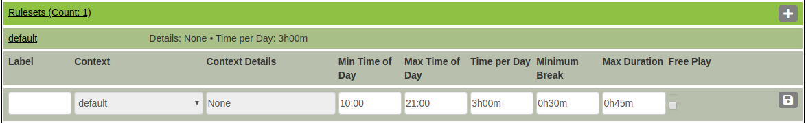

The fields represent the following restrictions/meaning:

*   *Label*: changes the default label of the rule in lists and messages.

*   *Context*: sets the context (type) of rule. Currently, there are three contexts available. See below.

*   *Context details*: sets the specific details of the chosen context. See below.

*   *Optional time*: When set this optional time can be used by the user to request time extensions in sessions. The
    time is valid for a whole day. Whenever the user requests a time extension the duration will be subtracted from
    this value.

*   *Min Time of Day*: optionally sets the earliest time of the day when login is allowed. Timestamps must be given 
in the format `HH:MM` in military time. Time durations must be given in the format `HHh:MMm`.  Either part may be 
omitted and the minutes may exceed 60.
   
*   *Max Time of Day*: optionally sets the latest time of the day when login is allowed. The format is the same 
as above.  

*   *Time per Day*: optionally sets the duration that the user is allowed to be logged in (for the whole day). 
The format must be `HHh:MMm` for `HH` hours and `MM` minutes. Either part can be omitted.  

*   *Minimum Break*: optionally sets a mandatory break time between sessions. The format is the same as above.

*   *Max Duration*: optionally sets the maximum length of a session. The format is the same as above.

*   *Free Play*: If ticked, the user is allowed to play without any restrictions. Any other restriction in the same
rule will be suppressed.

### Computing the Break Time

When there is a maximum session time and a minimum break time configured for a rule `LittleBrother` tries to compute
a *fair* break duration as follows:

*   If a user has played her full maximum session time the whole configured break time will apply.

*   If a user has played less than her maximum session time the break time will be enforced proportionally that is
the effective break time compared to the configured break time will have the same ratio as the actual session time
to the maximum session time. Example: the maximum session time is set to 1 hour and the break time to 30 minutes. The
user decides to play for 40 minutes in her session which accounts for two thirds of the maximum session time. Hence,
the break time will be `2/3*30=20` minutes.    

### Rule Contexts

Each rule can be seen as a day selector. If all days are to be treated equally one rule should do the job. 

If different days are to be treated differently more rules are required besides the default *catch all* rule. 
To this purpose the setting *Context* can be used. If its value is `weekplan` the setting
*Context Details* will contain either:

*   the adverb referring to the day of the week (e.g. `sundays`),

*   the string `weekend` comprising Saturday and Sunday, or day-coded seven-character string in which `1`, `X`, or `Y` 
denotes an active day and any other character denotes an inactive day. For example: the string "X-X-X--" would denote 
a rule which is active on Mondays, Wednesdays, and Fridays. 

If the value of *Context* is `german-vacation-calendar` the rule is active for all vacation days of a specific 
federal state in Germany. In this case the value of `context_details` denotes the name of the federal state:

*   `Baden-Württemberg`,
*   `Bayern`,
*   `Berlin`,
*   `Brandenburg`,
*   `Bremen`,
*   `Hamburg`,
*   `Hessen`,
*   `Mecklenburg-Vorpommern`,
*   `Niedersachsen`,
*   `Nordrhein-Westfalen`,
*   `Rheinland-Pfalz`,
*   `Saarland`,
*   `Sachsen`,
*   `Sachsen-Anhalt`,
*   `Schleswig-Holstein`, or
*   `Thüringen`.

Note that the vacation schedules are retrieved from the website 
[www.mehr-schulferien.de](https://www.mehr-schulferien.de). The author of `LittleBrother` cannot be held responsible 
for incorrect schedules.
 
### Associating Devices with Users

In addition to the hosts which are scanned for logins of the monitored users `LittleBrother` can be configured to
also scan the activity on other devices, e.g. game consoles or smartphones. The assumption is that there is activity 
on one of these
devices when they respond to a [ping](https://searchnetworking.techtarget.com/definition/ping). Of course, this is a
simplification, but it may work in some cases. Please, consider the inherent restrictions:

*   The fact that a ping is received just means that the device is "on". However, there may not be any activity on it.
In this case the play time will be overestimated. Also, some devices may automatically turn on to check for updates.
This will result in phantom play time (sometimes at very odd hours of a day).

*   The ping cannot differentiate between users. So this setup only works well, if the devices can clearly be
associated with monitored users and are not shared too often.

*   Devices which can be played offline will not respond to a ping if disconnected from the local network. In this 
case the play time will be underestimated.

*   The ping returned by smartphones is sometimes hard to interpret. The correlation between successful pings and
actual usage is small. The monitoring has to be improved by actually measuring the delay of the ping which requires
some fine-tuning.

**Note**: The following steps are only available if devices have already been set up. See section 
*Configuring Devices* below. 

To associate a device with a user select the device from the popdown menu

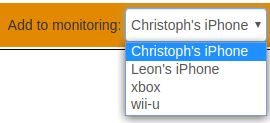

and click the add button

The top level device overview will show a comma separated list of all devices.

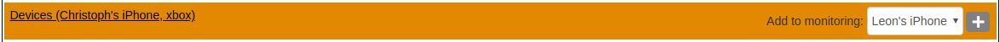
 
Clicking on *Devices* will open the second level with a list of all device association and some details

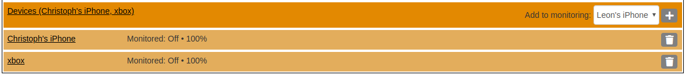

In order to change the settings of a device association clicking on the device name. This will open the third level:

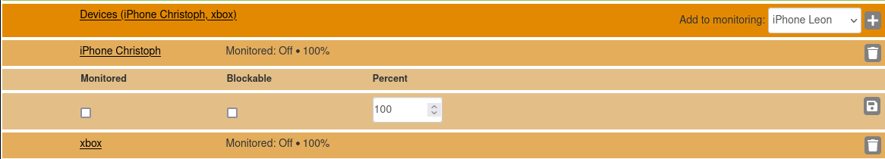

The columns contain the following details:

* *Monitored*: denotes if the device is scanned for the user. Use this switch to temporarily deactivate the scanning.
The flag is off by default. It needs to be activated for a new association.
* *Blockable*: denotes if the network communication of this device is to be blocked when the user has exceeded her
  time budget. This is done by inserting an appropriate rule into `iptables`. See 
* [Advanced Topics](ADVANCED_TOPICS.md) for setting up this functionality.   

* *Percent*: denotes the percentage with which the active time of this device will be added as play time to the 
associated user. The default is 100%. Choosing a value below 100% can be interpreted as e.g. a "social" bonus for a 
console which allows multiplayer games or e.g. a typical fraction of time that the user spends on the device 
compared to the overall use of the device (by other users).

To save the settings click on the save button:    

 
## Configuring Devices

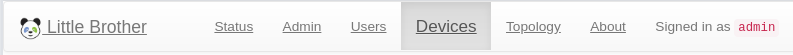
        
In addition to the processes of the Linux host the application `LittleBrother` can be configured to monitor 
activity on other devices by using the ICMP protocol (`ping`). The assumption is that when a device returns a 
quick response to ping it is currently active (or rather has an active user logged in). If, on the other hand,
the response is slow or if there is no response at all the device is regarded as inactive.

Note that `LittleBrother` is not able to terminate any processes on the monitored devices so that the users
may easily exceed their permitted access times there. However, any login times on these devices are added to
the access times on the Linux hosts so that the remaining access time is still influenced. Also, the minimum
break time will apply the point of time when the last other device became inactive.    

As of version 0.4.23 `LittleBrother` may be able to at least restrict network access to the monitored devices.
See the section on `iptables` in [Advanced Topics](ADVANCED_TOPICS.md) for details.

The top level of the devices page shows a list of all configured devices. If the devices are associated with users
their names are shown and also their respective usage percentages.

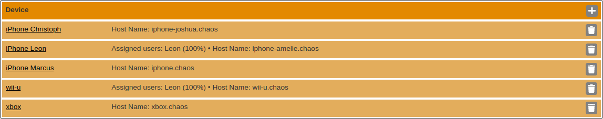

Clicking on a device name opens the second level showing details on the specific device.

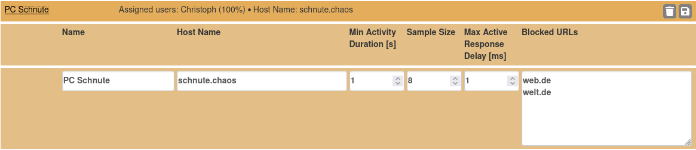

The fields have the following meaning:

* *Name*: The logical name of the device which will show up in lists. The logical name has to be unique across all
devices.

* *Host Name*: The DNS name or IP address of the device. This address will be used for *pinging* the device. It has to
be a valid address which can be resolved by the name server. Otherwise, the entry will be rejected. Also, the hostname
has to be unique across all devices. If you want to monitor devices in your local WI-FI you have to see to it 
that your WI-FI router always issues the same IP numbers to the same devices. Usually, there is a way to configure the
router accordingly. Look out for *persistent IP addresses* in the manual.

    As of version 0.3.12 of `LittleBrother` the host name may also have an extended format permitting to ping devices
    behind a firewall. This feature is supported by [ProxyPing](https://github.com/marcus67/proxy_ping). In this case the
    host name has the following format

        proxy.host.name:port,device.host.name
    
    where `proxy.host.name` ist the DNS name of proxy host and `port` is the optional port number. `device.host.name`
    denotes the DNS name of the actual device. The port defaults to `6666` which is the default of `ProxyPing`. If 
    no port is given the colon has to be omitted, too. Of course, instead of either host name an IP address may be used. 

    Some examples:

    | Host Specification                       | Description                                                                                                                      |                                                                                                                                                                                                                                                                                                                                    
    |:-----------------------------------------|:---------------------------------------------------------------------------------------------------------------------------------|
    | `my.device.net`                          | Direct ping to device with DNS name `my.device.net`                                                                              |
    | `192.168.5.2`                            | Direct ping to device with IP address `192.168.5.2`                                                                              |
    | `my.proxy.somenet,my.hidden.device`      | Proxy ping to device with DNS name `my.hidden.device` using `ProxyPing` located at `my.proxy.somenet` using default port `6666`  |
    | `my.proxy.somenet:6665,my.hidden.device` | Proxy ping to device with DNS name `my.hidden.device` using `ProxyPing` located at `my.proxy.somenet` using explicit port `6665` |

    **Note** that `LittleBrother` will only check the validity of the proxy host 
    name, whereas the `device.host.name` will not be checked. For the time being, format errors in the specification above
    or a wrong device host name will silently be ignored resulting in the device being regarded as *down* all the time.   

* *Min Activity Duration \[s\]*:  Denotes how many seconds a ping has to be responsive before the device is regarded 
as active. Durations shorter than this period will be ignored completely.

* *Max Active Response Delay \[ms\]*: Denotes the maximum response time (measured in milliseconds) a ping may have to 
still be regarded as 'active'. For game consoles (often using the local area network) a low value of 10 \[ms\] is 
usually OK. For smartphone using WI-FI the value needs to be higher since these devices have a more sluggish response. 
For iPhones over WI-FI values between 50 \[ms\] and 80 \[ms\] have been tested to work pretty well. You will have to 
monitor the value a bit during the initial phase. If `LittleBrother` often detects activity where there is none, 
decrease the value. If, on the other had, activity often goes undetected, increase the value.

* *Sample Size*: Denotes the number of delay samples used to compute the effective delay as moving average. This value
can probably be left as it is.
* *Blocked URLs*: Use this text are to override the globally URLs which are blocked for the device if the assigned user
  has exceeded his time budget. Use one DNS name or IP address per line. Each DNS address is checked before the entry
  can be saved. **Note:** These entries completely *replace* the default entries. If you want to have some of the 
  default entries active you will have to repeat them here! 
To make changes enter the desired values and click the save button.

### Adding devices

To add a new device click the add button in the top row:

A new device is added with the generic name "New Device N". Open the entry, edit the settings, and save them. 

